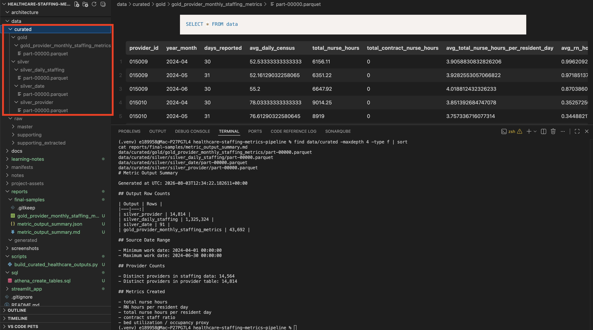
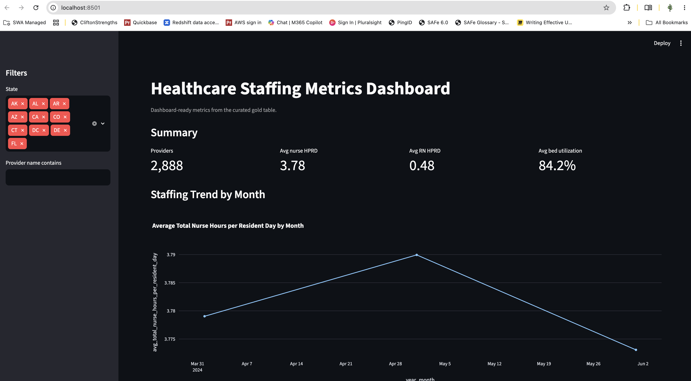
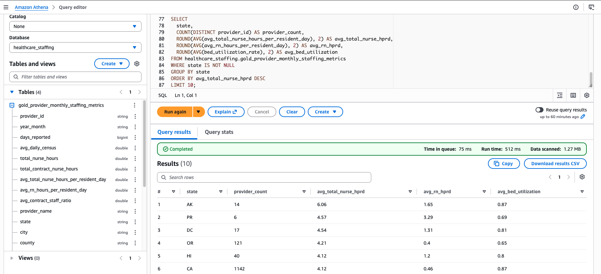

# Healthcare Staffing Metrics Pipeline

## Project Overview

This project builds an AWS-based healthcare staffing analytics pipeline for nursing home staffing and facility performance data.

The goal is to ingest healthcare staffing files, validate the source data, transform the data into analytics-ready tables, calculate staffing and facility metrics, and present the results in a Streamlit dashboard.

## Planned Architecture

Google Drive source files  
→ AWS Glue Workflow scheduled trigger  
→ AWS Glue Python Shell job for Google Drive ingestion  
→ Amazon S3 raw zone  
→ AWS Glue Data Catalog raw tables  
→ separate AWS Glue/PySpark jobs for silver tables  
→ AWS Glue/PySpark job for gold metrics table  
→ Amazon S3 curated Parquet tables  
→ AWS Glue Data Catalog curated tables  
→ Amazon Athena query layer  
→ Streamlit dashboard

## Initial Metrics

Calculated metrics based on the available data:

1. Total nurse hours
2. Total nurse hours per resident day
3. RN hours per resident day
4. Contract staff ratio
5. Bed utilization rate

These metrics were selected because they can be traced to fields in the PBJ staffing file and provider information file.

Metrics such as overtime, shifts per nurse, length of stay, readmissions, payroll cost, and patient satisfaction were not included in the first build because the required fields were not available or were not validated for this version.

## Project Status

Current phase: Local curated pipeline, metric outputs, documentation, and dashboard validation after SME architecture approval.

Implementation note: This repo includes a local validation script plus AWS-ready Glue job scripts. The single local script was used to validate outputs quickly due to project timeline; the Glue job scripts show how the same logic maps to the approved Glue Workflow design.

Key docs:

- `docs/implementation-status.md` - what was built, validated, and left as AWS-ready structure
- `docs/metric-calculation-notes.md` - metric formulas and source columns
- `docs/project-question-responses.md` - which project questions the data can and cannot answer

## Validation Screenshots

The screenshots below show the main pieces of the project working.

### Local Pipeline Output

The local validation script created the silver and gold Parquet outputs and generated the metric summary files.

### Streamlit Dashboard

The dashboard reads the generated gold metrics table and displays staffing, census, bed utilization, and contract staffing views.

### Athena Query Validation

The curated gold output was uploaded to S3 and queried through Athena.

## Final Reference Docs

- [Data dictionary](docs/data-dictionary.md)
- [Data lake fundamentals notes](learning-notes/05-data-lake-fundamentals.md)
- [Streamlit dashboard notes](learning-notes/06-streamlit-dashboard-notes.md)

## Repository Structure

- `analysis/` - source profiling scripts and outputs
- `glue_jobs/` - AWS-ready Glue Python Shell and Glue/PySpark job scripts
- `scripts/` - ingestion, transformation, and metric scripts
- `docs/` - architecture, solution design, data model, and metric documentation
- `streamlit_app/` - dashboard application
- `sql/` - Athena SQL or table creation scripts
- `learning-notes/` - public project learning notes
- `screenshots/` - walkthrough screenshots
- `reports/final-samples/` - selected final report/dashboard samples
