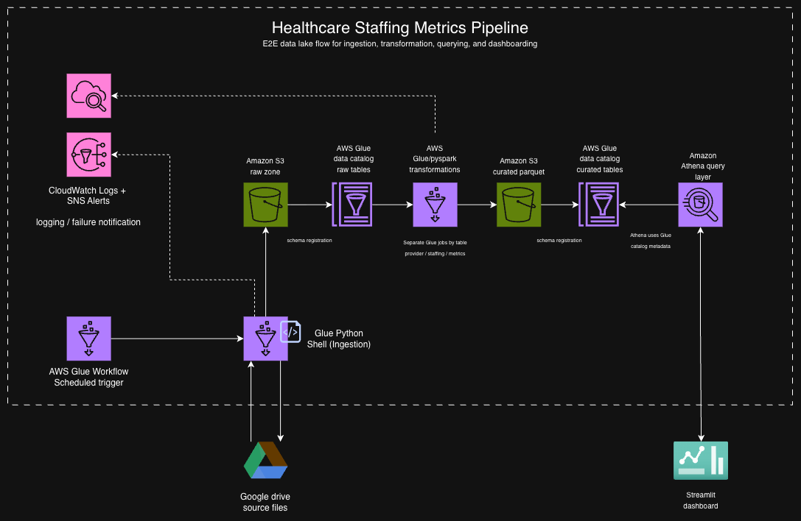

# Healthcare Staffing Metrics Pipeline - Architecture Design

## Purpose

This document defines the proposed AWS architecture for the Healthcare Staffing Metrics project.

The project goal is to create a unified analytics view of nursing home staffing and facility performance. The system should support staffing metrics, facility utilization metrics, selected quality/rating comparisons, and a Streamlit dashboard.

## Architecture Diagram



## Architecture Summary

Proposed flow:

```text
AWS Glue Workflow scheduled trigger
→ AWS Glue Python Shell job for Google Drive ingestion
→ Amazon S3 raw zone
→ AWS Glue Data Catalog raw tables
→ AWS Glue PySpark jobs for silver tables
→ AWS Glue PySpark job for gold metrics table
→ Amazon S3 curated Parquet tables
→ AWS Glue Data Catalog curated tables
→ Amazon Athena query layer
→ Streamlit dashboard
```

Supporting services:

- S3 ingestion manifest for lightweight file tracking
- CloudWatch Logs for Glue job logs
- SNS alerts if failure notification is needed

## Why This Architecture

This design follows a simple AWS data lake pattern.

The pipeline uses AWS Glue Workflow to keep orchestration and job runtime consolidated in Glue. The first Glue job handles Python-based ingestion from Google Drive. Separate Glue PySpark jobs handle the transformation work for individual silver and gold outputs.

This keeps the project easier to explain and maintain while still separating ingestion, transformation, and dashboard-ready outputs.

## Google Drive as Source

The project source files are provided through Google Drive.

The ingestion job checks the Google Drive source files, compares file metadata against the S3 ingestion manifest, and loads only files that are new, changed, or previously failed.

## AWS Glue Workflow

AWS Glue Workflow is used to coordinate the pipeline.

The workflow can start from a scheduled trigger, run the ingestion job, and then run downstream transformation jobs after the required upstream step succeeds.

## Glue Python Shell for Ingestion

The ingestion step runs as an AWS Glue Python Shell job.

This job is responsible for:

- checking Google Drive file metadata
- comparing files against the S3 ingestion manifest
- loading new or changed files into S3 raw
- updating the manifest with load status and errors

## Amazon S3 for Raw and Curated Storage

S3 is used as the data lake storage layer.

Raw files are kept unchanged in the raw zone. Curated files are written separately after transformation.

The raw zone keeps the original source files unchanged so the data can be reprocessed if needed.

## S3 Ingestion Manifest

An S3 manifest file tracks file-level ingestion state.

The manifest can store source file ID, file name, modified time, file size/checksum, S3 raw path, batch ID, processing status, and error message.

## AWS Glue Data Catalog

The Glue Data Catalog stores metadata about raw and curated datasets so files in S3 can be queried as tables.

The diagram shows raw and curated catalog layers separately to make the pipeline stages easier to understand. They are not separate catalog products.

## AWS Glue / PySpark for Transformations

The transformation layer runs as multiple AWS Glue PySpark jobs for better control.

Planned jobs:

1. `job_build_silver_provider` writes `silver_provider`.
2. `job_build_silver_daily_staffing` writes `silver_daily_staffing`.
3. `job_build_silver_date` writes `silver_date`.
4. `job_build_gold_provider_monthly_metrics` writes `gold_provider_monthly_staffing_metrics`.

Splitting the silver/gold tables into separate jobs provides better control. If one table fails, that job can be reviewed and rerun without rerunning the entire transformation layer.

## Silver and Gold Outputs

Silver tables are cleaned, standardized tables that stay close to the source data.

Gold tables are dashboard-ready tables with joined and aggregated metrics.

## Parquet for Curated Outputs

Curated data will be stored as Parquet because it is columnar and efficient for analytics.

## Athena for SQL Queries

Athena provides a serverless SQL query layer over the curated S3 data.

Athena uses the Glue Data Catalog metadata to understand the curated tables.

## Streamlit for Dashboarding

Streamlit is used to create an interactive dashboard for staffing and facility performance metrics.

## Monitoring and Logging

CloudWatch Logs can capture Glue job logs.

SNS can be used for failure alerts if notification is needed for the project demo.

## Failure Recovery

The design supports recovery because raw files are retained in S3.

If ingestion fails, the manifest and CloudWatch logs help identify the failed file or batch. If transformation fails, the failed Glue job can be fixed and rerun from the preserved raw or silver input.

## Data Quality Checks

Planned checks:

- expected file presence
- file size and checksum capture
- CSV readability
- expected column validation
- row count checks
- duplicate provider/date checks
- missing value checks
- negative or invalid numeric checks
- join coverage checks between staffing and provider files
- metric sanity checks

## Security

Planned security practices:

- no credentials committed to GitHub
- S3 encryption
- IAM least privilege
- environment variables or AWS Secrets Manager for credentials
- raw data kept out of the public repository

## Summary

The design keeps orchestration and job runtime inside AWS Glue, preserves original source files in S3 raw, builds separate silver/gold outputs with Glue/PySpark jobs, writes curated Parquet tables to S3, registers metadata in the Glue Data Catalog, queries with Athena, and displays the results in Streamlit.
